## Idea

Splitting $|x - c|$ into cases swaps the V for one straight branch at a time,
but each case equation solves against that branch's whole line, not just its
half. A root on the wrong half is where the other curve meets the dashed
extension, not the graph, and it has to be thrown out.

## Definition

To solve an equation containing $|x - c|$:

- Case $x \ge c$: replace $|x - c|$ by $x - c$, solve, keep only roots with $x \ge c$.
- Case $x < c$: replace $|x - c|$ by $c - x$, solve, keep only roots with $x < c$.

The solution set is the union of what the two cases keep.

## Example

$|x - 1| = 2x$. Case $x \ge 1$: $x - 1 = 2x$ gives $x = -1$, which is not
$\ge 1$, so it is rejected. Case $x < 1$: $1 - x = 2x$ gives $x = \tfrac13$,
kept. One solution, $x = \tfrac13$.

## Pitfalls

Test each root against its own case, not the other one. A root rejected in one
case is not a solution at all — it does not move over to the other case.

## See also

[Two functions are equal when they agree at every point of their domain](equal-functions-agree-pointwise.md)
