## Idea

A function is its input–output pairs, not its formula. Two functions with the
same domain and codomain are equal (서로 같은 함수) exactly when every input
gives the same output — so on a small domain, very different formulas can
define the same function.

## Definition

$f: X \to Y$ and $g: X \to Y$ are equal, $f = g$, when $f(x) = g(x)$ for every
$x \in X$.

On a finite $X = \lbrace x_1, \dots, x_n \rbrace$ that is one equation per
element: the two graphs must meet above each $x_i$, and nothing else matters.

## Example

On $X = \lbrace -1, 0, 1 \rbrace$, $f(x) = x^3$ and $g(x) = x$ are the same
function, since $(-1)^3 = -1$, $0^3 = 0$ and $1^3 = 1$. On $\mathbb{R}$ they
differ — at $x = 2$, for one.

## Pitfalls

With an unknown element, $X = \lbrace p, q, a \rbrace$, pin the constants with
$p$ and $q$ first, then solve $f(a) = g(a)$. That equation already holds at $p$
and $q$, so factor them out as known roots — which is also why such problems
add $a \ne p$ and $a \ne q$.

## See also

[An absolute-value equation solved by cases keeps only the roots inside each case](absolute-value-cases-keep-their-own-roots.md)
