## Idea

The graph of $f^{-1}$ (역함수) is the mirror image of the graph of $f$ across
$y=x$. When $f$ is increasing, the two can meet only on that mirror, so
$f(x)=f^{-1}(x)$ is the same equation as $f(x)=x$ — usually a far easier one.

## Definition

If $f$ is strictly increasing with inverse $g$, then wherever both are defined

$$f(x)=g(x) \iff f(x)=x.$$

## Why it holds

Say $f(p)=g(p)=q$. Then $f(p)=q$, and $g(p)=q$ means $f(q)=p$: both $(p,q)$
and $(q,p)$ lie on the graph of $f$. If $p < q$, then $f(p)=q > p=f(q)$, so
$f$ went down — and likewise if $p > q$. Hence $p=q$, that is $f(p)=p$.
Conversely $f(p)=p$ gives $g(p)=p$.

## Example

$x^3=\sqrt[3]{x}$ cubes to the ninth-degree $x^9=x$, but $x^3$ is increasing,
so it is just $x^3=x$: $x=-1, 0, 1$.

## Pitfalls

A decreasing $f$ gets no shortcut. $-x^3=-\sqrt[3]{x}$ has the roots
$x=0,\pm1$, yet only $x=0$ solves $-x^3=x$: the other two are the mirror pair
$(1,-1)$, $(-1,1)$, joined by a chord of slope $-1$ — exactly the chord an
increasing $f$ cannot have.

The function must increase on its whole domain. A piecewise $f$ whose pieces
each increase, but whose ranges come out of order, can still swap two values.

## See also

- [A piecewise bijection fills each gap in the range exactly — in either direction](piecewise-bijection-fills-the-gap.md)
- [A curve symmetric about a line meets every perpendicular line in mirror pairs](../geometry/symmetric-curve-meets-perpendicular-lines-in-pairs.md)
