## Idea

Reflecting across a line $m$ carries every line perpendicular to $m$ onto
itself. So when a curve is symmetric about $m$, its intersections with such a
line come in mirror pairs, and so do its tangencies. The count is odd only when
the line meets the curve on $m$ itself.

## Definition

Let a curve $C$ be symmetric about $m$, and let $\ell \perp m$ cross $m$ at
$M$. The points where $\ell$ meets $C$ pair up symmetrically about $M$, and
only $M$ can be left unpaired. If $\ell$ touches $C$ at $P$, it also touches
$C$ at the mirror image of $P$.

The reflection across $x+y=k$ is $(x,y) \mapsto (k-y, k-x)$; it carries every
line of slope $1$ onto itself.

## Example

$y=\sqrt{x-a}+b$ for $x \ge a$ and $y=b-(x-a)^2$ for $x < a$ are mirror images
across $x+y=a+b$: the point $(a+s^2, b+s)$ goes to $(a-s, b-s^2)$. Against a
line $y=x+c$, both pieces give the same quadratic $s^2-s+(a-b+c)=0$, with
$s=\sqrt{x-a}$ on the right and $s=a-x$ on the left.

With $a=b=0$ (the figure): $c=\tfrac{3}{16}$ gives $s=\tfrac14,\tfrac34$ and
four points; $c=\tfrac14$ gives the double root $s=\tfrac12$, a tangency to
both pieces at once; $c=0$ gives $s=0,1$ and three points, since $s=0$ is the
joint, which lies on the axis.

## Pitfalls

The axis above is $x+y=a+b$, of slope $-1$, not $y=x$: $b-(x-a)^2$ is not the
inverse of $\sqrt{x-a}+b$.

Only perpendicular lines are carried onto themselves. A line of any other slope
is sent to a different line, and its intersections need not pair up.

## See also

- [An increasing function meets its inverse only on $y=x$](../algebra/increasing-function-meets-inverse-on-diagonal.md)
- [An odd solution count across two quadratics pins the parameter at a degenerate case](../algebra/odd-count-forces-a-degenerate-case.md)
